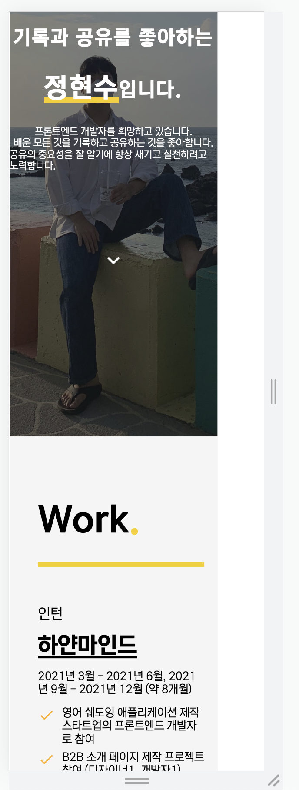
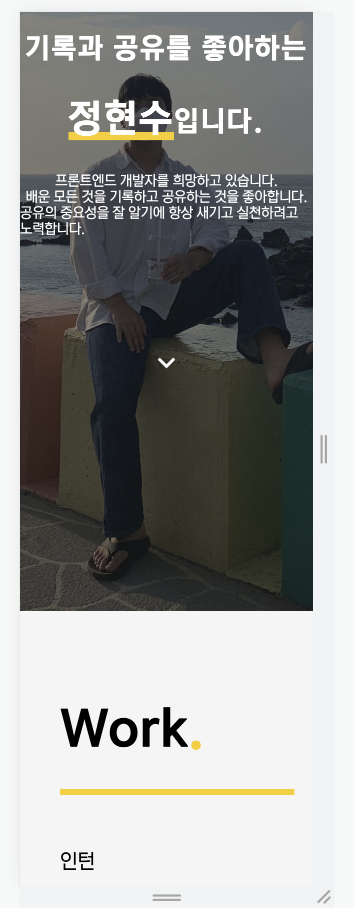

# HTML

## 🤔 innerHTML vs innerText vs textContent

### `innerHTML`

해당 Element의 HTML, XML을 읽어오거나, 설정할 수 있습니다.
정확하게 어떤 마크업으로 되어있는지, 공백이나 줄 띄움을 전부 보고싶다면 해당 속성을 이용하면 됩니다.


### `innerText`

해당 Element 내에서 사용자에게 보여지는 텍스트를 읽거나 설정할 수 있습니다.
그래서 만약 `display: none` 된 요소가 있다면 해당 요소는 읽을 수 없습니다.

`innerText`는 단순한 플레인 텍스트로 긁어옵니다.


### `textContent`

`innerHTML`과 `innerText`는 Element의 속성이라면, `textContent`는 Node의 속성입니다.

`innerText`와는 다르게 `<script>`, `<style>`로 숨겨진 텍스트까지 읽어옵니다.
그래서 만약 해당 요소에 `display: none` 된 요소가 있어도 해당 텍스트를 전부 읽어옵니다.

`innerText`는 렌더링된 모양을 기준으로 긁어오지만, `textContent`는 그렇지 않습니다.

## 🤔 viewport에 대해서 알고 계신가요?

반응형 웹을 만드는 데에 중요한 개념이 바로 `viewport`에 대한 개념입니다.

[MDN에서 설명하는 `viewport`](https://developer.mozilla.org/ko/docs/Glossary/Viewport)는 **현재 화면에서 보여지고 있는 부분**을 말합니다. 그러니까 현재 화면에서 보여지지 않은 웹 사이트의 부분들은 스크롤을 통해서 볼 수 있는 것이죠.

우리가 웹 사이트를 이용하는 기기가 노트북이나 데스크탑만 있는 것이 아니라 모바일, 태블릿 등 다양한 기기에서 웹을 사용할 수 있습니다.
데스크탑이나 노트북에서 `viewport`는 브라우저의 크기를 말합니다. 데스크탑이나 노트북에서는 브라우저의 크기를 조정할 수 있으나
모바일이나 태블릿에서는 브라우저의 크기를 조정하기가 힘듭니다. (배율을 조정하는 것은 `viewport` **크기**가 변하는 것이 아닙니다.)

요기서 문제점이 발생합니다. 데스크탑을 기반으로 설계된 웹을 모바일에서 보려고 할 때 큰 데스크탑의 웹 페이지를 모두 표시하려고 하다보니 전체적인 페이지의 배율이 조정이 되는 것입니다. 그로 인해 컨텐츠의 배율 축소가 발생해서 가독성이 떨어지게 됩니다.

그래서 `viewport`를 사용해서 다양한 모바일, 태블릿 기기에서 페이지의 너비나 배율을 설정해서 일정한 컨텐츠의 크기로 볼 수 있도록 할 수 있습니다.

### viewport를 사용하지 않았을 때

<details>
<summary>사진 보기</summary>



</details>

컨텐츠의 비율이 축소됩니다.

### viewport를 사용했을 때

<details>
<summary>사진 보기</summary>



</details>

컨텐츠의 비율이 축소되지 않습니다.

### viewport 사용법

기본적으로 `viewport` 사용하는 것은 `head` 태그 사이에 넣어서 사용할 수 있습니다.

```html
<html>
	<head>
		<meta name="viewport" options...>
	</head>
	<body>
	</body>
</html>
```

`viewport`의 프로퍼티들은 다음과 같습니다.

- `width`: `viewport`의 가로 크기를 조정합니다. 일반적인 숫자값이 들어 갈 수도 있고, `device-width`와 같은 특정한 값을 사용할 수도 있습니다. `device-width`는 100% 스케일에서 CSS 픽셀들로 계산된 화면의 폭을 의미합니다.
- height : `viewport`의 세로 크기를 조정합니다.
- initial-scale : 페이지가 처음 로딩될 때 줌 레벨을 조정합니다. 값이 1일때는 CSS 픽셀과 기기종속적인 픽셀 간의 1:1 관계를 형성합니다.
- `minimum-scale` : `viewport`의 최소 배율값, 기본값은 0.25입니다.
- `maximum-scale` : `viewport`의 최대 배율값, 기본값은 1.6입니다.
- `user-scalable` : 사용자의 확대/축소 기능을 설정, 기본값은 yes입니다.


정의된 속성 값들은 다음과 같습니다.

- `device-width` : 기기의 가로 넓이 픽셀 값 (웹페이지의 가로(width) 값은 기기가 사용하는 가로 넓이 값(device-width) 만큼 적용하여 사용하라는 의미)
- `device-height` : 기기의 세로 높이 픽셀 값

### 참고

- [뷰포트란 무엇일까?](https://jw910911.tistory.com/24)
